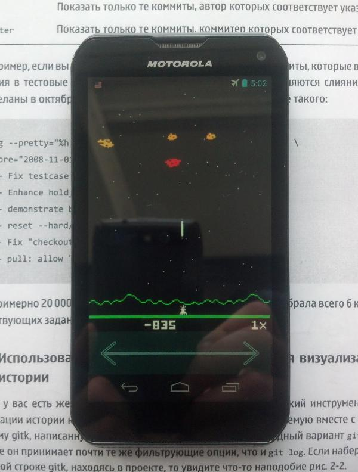
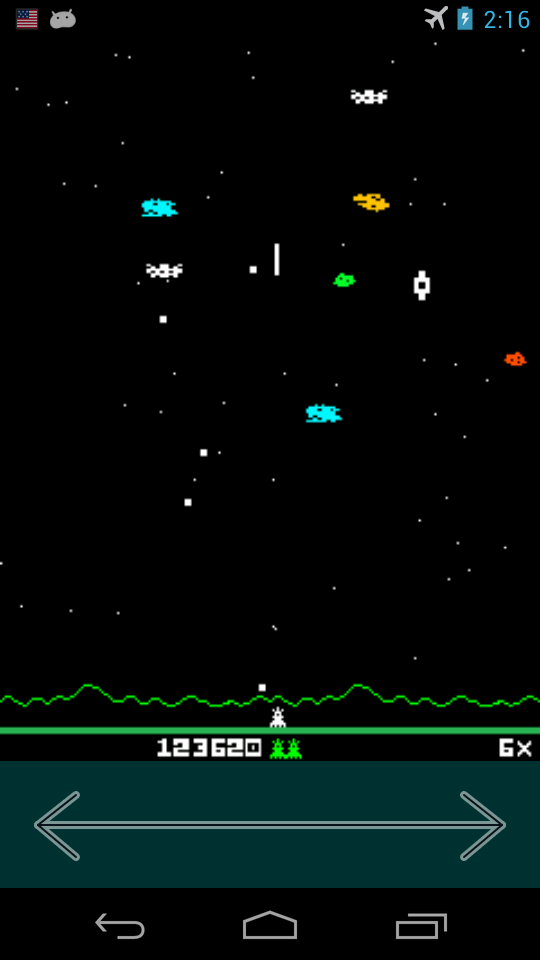

AstroSmash
=============

Astrosmash is a video game for the Intellivision videogame console, designed by John Sohl, and released by Mattel Electronics in 1981. The game involves using a laser cannon to destroy falling meteors, bombs, and other targets. More than one million copies were sold, and the game replaced Las Vegas Poker & Blackjack as the game included with the Intellivision console. - [Wikipedia](https://en.wikipedia.org/wiki/Astrosmash).



This is my port of AstroSmash from Java ME (J2ME) MIDlet to Android OS application with using SurfaceView Canvas drawing. I added touch controls and some game engine improvements. I used the [Java Decompiler](https://en.wikipedia.org/wiki/Java_Decompiler) to understand the logic and restore the behavior of the original game.



## Download

You can download APK-package for Android OS from the [releases](https://github.com/EXL/AstroSmash/releases) section.

## Build instructions

For example, GNU/Linux:

* Install the latest [Android SDK](https://developer.android.com/sdk/);

* Clone repository into deploy directory;

```sh
cd ~/Deploy/
git clone https://github.com/EXL/AstroSmash AstroSmashAndroid
```

* Build the APK-package into deploy directory with Gradle building script;

```sh
cd ~/Deploy/AstroSmashAndroid/
ANDROID_HOME="/opt/android-sdk/" ./gradlew assembleDebug
```

* Install AstroSmash APK-package on your Android device via adb;

```sh
cd ~/Deploy/AstroSmashAndroid/
/opt/android-sdk/platform-tools/adb install -r astrosmash/build/outputs/apk/astrosmash-debug.apk
```

* Run and enjoy!

You can also open this project in Android Studio IDE and build the APK-package by using this program.

## More information

Please read [Porting Guide (In Russian)](http://exlmoto.ru/astrosmash-droid) for more info about porting AstroSmash to Android OS.
